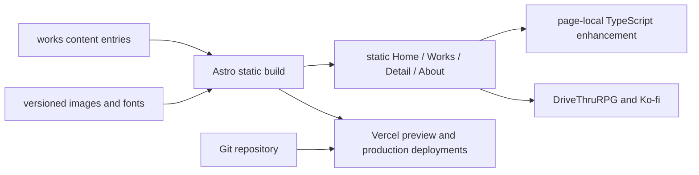

# Architecture Spine - Tales by Xero

## Design Paradigm

**Static site generation with progressive enhancement.** Astro statically renders all public content from a local `works` collection. Semantic HTML and native CSS are the baseline. Page-local TypeScript only enhances local behavior; no public content, CTA, or navigation depends on client JavaScript.



## Invariants & Rules

### AD-1 - Static Astro boundary [ADOPTED]

- **Binds:** all public pages, FR-1, FR-4, FR-9 through FR-18
- **Prevents:** a client-rendered app, server-rendered features, or runtime service dependencies becoming the default implementation.
- **Rule:** Build v1 with Astro and TypeScript in static output mode. Do not add a database, CMS, authentication, commerce service, or server-rendered route. Vercel serves build output only.

### AD-2 - One validated source of truth for works [ADOPTED]

- **Binds:** works catalog, routes, product detail pages, FR-5 through FR-18
- **Prevents:** duplicate product metadata, divergent product images, dead CTAs, and inconsistent recommendation links across surfaces.
- **Rule:** Every work is one Markdown entry in the local build-time `works` collection. The normative schema below validates reusable frontmatter; the Markdown body is reserved for optional selected detail blocks only. Home, Works, detail routes, Discovery Routes, One-Shot Vibe Selection, and Next Work resolve from this collection only.

### AD-3 - Published content is build-gated [ADOPTED]

- **Binds:** public discovery and catalog surfaces, FR-6, FR-9, FR-10, FR-12, FR-16, FR-18
- **Prevents:** unpublished works, invalid product routes, missing external handoffs, or dangling Next Work targets becoming public.
- **Rule:** A `published` work must satisfy every required schema field below. Production collection queries render only `published` entries. Build validation rejects duplicate slugs, invalid required fields, image references outside the owning work directory, a Next Work self-reference, or a Next Work target that is not another published work. Directed Next Work cycles are permitted when intentional.

### AD-4 - Progressive local interaction [ADOPTED]

- **Binds:** One-Shot Vibe Selection, optional Works filter, mobile navigation, FR-2, FR-6, FR-11
- **Prevents:** React hydration, shared client state, JavaScript-only navigation, and history behavior that disappears on reload.
- **Rule:** Use native controls and links first. Add isolated TypeScript modules only to the page that owns an interaction. The canonical One-Shot Vibe Selection state is `/#one-shot-vibes`: opening the selector adds this fragment with `history.pushState`; closing it removes the fragment; `popstate` and `hashchange` restore the corresponding state. `/#one-shot-vibes` renders the same static inline selection without JavaScript. The individual Vibe choices are regular `/works/<slug>` links.

### AD-5 - Native CSS token system [ADOPTED]

- **Binds:** all UI, FR-2, FR-3, FR-11, FR-13, accessibility and responsive requirements
- **Prevents:** per-component color, spacing, focus, layer, or motion values drifting from Saffron Myth Theatre.
- **Rule:** Native CSS Custom Properties are the only styling system in v1; do not add Tailwind. Define primitive, semantic, and component token layers. Components consume semantic or component tokens, never raw visual values except inside the primitive-token definition. Global tokens include focus, touch-target, z-index, and reduced-motion rules.

### AD-6 - Motion is optional and locally owned [ADOPTED]

- **Binds:** all motion, FR-3, FR-5, FR-6, responsive and reduced-motion requirements
- **Prevents:** animation-dependent content, global smooth-scroll behavior, unbounded animation dependencies, and inconsistent reduced-motion handling.
- **Rule:** CSS handles standard hover, focus, opacity, and transform feedback. Do not add React, Lenis, or Vanta in v1. Add GSAP only after a prototype proves that a small, named, non-essential narrative sequence cannot be delivered with CSS; import it only from the page-local module that owns that sequence. Under `prefers-reduced-motion`, client motion does not initialize and CSS renders the final state.

### AD-7 - Versioned first-party assets [ADOPTED]

- **Binds:** product imagery, fonts, FR-3, FR-8, FR-12, performance requirements
- **Prevents:** third-party asset tracking, inconsistent crops, external asset outages, layout shift, and page-specific asset duplication.
- **Rule:** Store product images under their work slug and self-host fonts in the repository. The owning `works` entry selects its images. Use Astro build-time image handling with declared dimensions or aspect ratios. Do not add an external image CDN or font provider in v1.

### AD-8 - Same-tab external handoff [ADOPTED]

- **Binds:** all DriveThruRPG, Ko-fi, and other external links, FR-16 and FR-20
- **Prevents:** inconsistent target behavior and loss of the curated product context.
- **Rule:** External destinations open in the same browser tab. Visible copy or accessible text identifies the destination and its external nature. Do not use `target="_blank"` for public external CTAs.

### AD-9 - Privacy boundary is provider-independent [ADOPTED]

- **Binds:** future analytics integration, FR-21 and FR-22
- **Prevents:** provider choice forcing advertising, cross-site tracking, persistent profiles, or analytics calls spread through UI components.
- **Rule:** Analytics remains deferred, but any future provider and event adapter may collect only the PRD's aggregate page, referrer, route-selection, Vibe Selection, and outbound CTA events. It must not create advertising profiles, use retargeting, or require unnecessary identifiers. UI modules call one provider-neutral `track(event)` adapter; no component talks directly to a provider SDK. The normative event contract and provider acceptance criteria below apply before provider selection.

### AD-10 - Build-first quality and Git deployment [ADOPTED]

- **Binds:** repository scripts, production releases, FR-1 through FR-22
- **Prevents:** unvalidated content, broken static output, unreviewed production deploys, and regressions in the required responsive or accessibility floor.
- **Rule:** `npm run lint` and `npm run build` are mandatory checks for every change. Git-connected Vercel creates preview deployments for branches and production deployments only from `main`; direct local production deploys are not used. Before public launch, automated accessibility checks and manual keyboard plus reduced-motion checks cover Home, Works, and one product detail page at 375, 768, 1024, and 1440 CSS pixels.

## Consistency Conventions

| Concern | Convention |
| --- | --- |
| Package management | npm with committed `package-lock.json`; Node.js `>=22.13.0` to satisfy Astro and ESLint. |
| Naming | `kebab-case` for paths, slugs, image directories, and content filenames; `camelCase` for TypeScript values; `PascalCase` only for TypeScript types. |
| Content | One `src/content/works/<slug>.md` entry per work. Its `slug` is the canonical public route key and its `nextWork` is another collection slug. |
| Assets | `src/assets/works/<slug>/` contains work-specific images. Each frontmatter image reference is imported or validated from that work's asset directory. |
| Client state | URL state is canonical for shareable or back-navigation-relevant UI. Otherwise state stays inside one page-local module. |
| Events | UI emits semantic names such as `discovery_route_selected`, `one_shot_vibe_selected`, and `outbound_product_clicked`; an analytics adapter is the only provider integration point. |
| Styling | Global token files define primitives, semantic aliases, component tokens, responsive rules, z-index layers, and reduced-motion fallbacks. Component styles may not introduce raw visual values. |
| External links | Same-tab only; links expose external destination text or an equivalent accessible label. |

## Normative Work Schema

`src/content.config.ts` implements this schema with Zod. The schema may gain optional fields, but the names, types, and meanings below may not change without a new architecture decision.

| Field | Type and cardinality | Rule |
| --- | --- | --- |
| `slug` | non-empty kebab-case string, one | Canonical `/works/<slug>` route and collection key; equals the content filename stem. |
| `status` | `draft` or `published`, one | Only `published` is eligible for public queries. |
| `title` | non-empty string, one | Public work title. |
| `type` | `one-shot`, `campaign-framework`, or `item-bundle`, one | Public product type. Add a type only through a schema decision. |
| `compatibility` | non-empty string, one | Visible system compatibility statement. |
| `premise` | non-empty string, one | One-sentence product premise. |
| `hook` | non-empty string, one | Product-detail hook directly under title. |
| `facts` | array of `{ label: string, value: string }`, one or more | Ordered Facts Strip; include only verified facts. |
| `images` | array of `{ src: string, alt: string, role: "hero" | "gallery" | "vibe" | "evidence" }`, one or more | `src` belongs to `src/assets/works/<slug>/`; every image has contextual alt text. Exactly one `hero` image is required for published works. |
| `externalUrl` | valid HTTPS `drivethrurpg.com` URL, one | Published work destination; the public DriveThruRPG CTA uses this exact URL. |
| `theMoment` | non-empty string, one | Spoiler-safe scene, NPC, location, object, conflict, or question. |
| `tableUse` | non-empty string, one | Concrete practical table value, structure, or included material. |
| `authorsNote` | non-empty string, one | Concise product-specific Author's Note. |
| `nextWork` | another work slug, one | For a published work, identifies a different published work. Directed cycles are allowed; self-references are not. |
| `discovery` | optional `{ route, order, vibe? }`, zero or one | `route` is `one-shot`, `campaign`, or `table`; `order` is positive integer. `vibe`, when present, is `{ id: kebab-case string, label: string, hook: string, order: positive integer }`. `route: "one-shot"` requires `type: "one-shot"` and `vibe`; `route: "campaign"` requires `type: "campaign-framework"` and forbids `vibe`; `route: "table"` requires `type: "item-bundle"` and forbids `vibe`. |
| `includedWith` | optional `{ work: string, label: string, notice: string }`, zero or one | `work` identifies another published work. Karrhold uses this field to reference Abythera and provides the no-separate-purchase notice required by FR-17. |
| `campaignRelation` | optional `{ work: string, label: string, standalone: boolean }`, zero or one | `work` identifies a published campaign framework. Ephemera uses this field with `work: "abythera"` and `standalone: true` to support both required Featured Work statements. |
| `seo` | `{ title: string, description: string }`, one | Page metadata for the public work route. |

`src/data/home.ts` is the only route-specific content configuration. It exports exactly these keys: `discoveryRoutes.oneShot`, `discoveryRoutes.campaign`, `discoveryRoutes.table`, `featuredWork`, and `tableTestedProof`. `discoveryRoutes.oneShot` is an array of published slugs that resolve to `discovery.route: "one-shot"`; it is the One-Shot Vibe Selection. `discoveryRoutes.campaign` and `discoveryRoutes.table` are one published slug each and resolve respectively to `discovery.route: "campaign"` and `discovery.route: "table"`. In v1, `campaign` is `abythera` and `table` is the Daggerheart Item Bundle slug. `featuredWork` is `ephemera`; its entry must have `campaignRelation.work: "abythera"` and `campaignRelation.standalone: true`. `tableTestedProof` is exactly `{ statement: string, evidence?: { workSlug: string, src: string } }`; `statement` is non-empty English text, and optional `evidence` resolves to an image of that published work with `role: "evidence"`.

Build validation also guarantees that each declared Discovery Route has one matching published work, that Vibe IDs are unique within the One-Shot Vibe Selection, and that all Home configuration references resolve to published entries.

## Normative Analytics Event Contract

The future provider adapter exports this exact discriminated union and function signature:

```ts
type AnalyticsEvent =
  | { name: "discovery_route_selected"; route: "one-shot" | "campaign" | "table" }
  | { name: "one_shot_vibe_selected"; vibeId: string; workSlug: string }
  | { name: "outbound_product_clicked"; workSlug: string; destination: "drivethrurpg" }
  | {
      name: "page_view";
      pageKind: "home" | "works" | "work" | "about";
      workSlug?: string;
      referrerKind: "direct" | "search" | "drivethrurpg" | "external" | "unknown";
    };

export function track(event: AnalyticsEvent): void;
```

`track(event)` is non-blocking, never delays navigation, and silently tolerates provider failure. Example: `track({ name: "outbound_product_clicked", workSlug: "ephemera", destination: "drivethrurpg" })`.

| Event | Required payload | Emission rule |
| --- | --- | --- |
| `discovery_route_selected` | `{ name: "discovery_route_selected", route }` | Emit once when a visitor activates a Discovery Route. |
| `one_shot_vibe_selected` | `{ name: "one_shot_vibe_selected", vibeId, workSlug }` | Emit once when a visitor activates a Vibe Selection work link. |
| `outbound_product_clicked` | `{ name: "outbound_product_clicked", workSlug, destination: "drivethrurpg" }` | Emit synchronously in the CTA activation handler before same-tab navigation; delivery is best-effort and does not prevent navigation. |
| `page_view` | `{ name: "page_view", pageKind, workSlug?, referrerKind }` | Emit only through `track(event)`. The adapter maps referrers to `referrerKind` and never forwards the raw referrer URL. Provider-native automatic page views are disabled unless they can be configured and tested to produce this exact sanitized contract. |

No event payload may contain a person ID, session ID, IP address, raw user agent, raw URL query string, full referrer URL, email address, or another direct or persistent identifier.

Before launch, the selected provider must be proven to: avoid client cookies and local identifiers; disable automatic collection outside this event contract; not retain or link source IP addresses or raw user agents beyond unavoidable transient transport processing; not use data for advertising or retargeting; and make its anonymization and retention behavior documentable in the public privacy information. A provider that cannot meet these conditions is ineligible.

## Stack

| Name | Version |
| --- | --- |
| Node.js | >=22.13.0 |
| Astro | 7.3.5 |
| TypeScript | 6.0.3 |
| Zod | supplied by Astro 7.3.5 |
| @astrojs/check | 0.9.10 |
| ESLint | 10.11.0 |
| Playwright | 1.63.0 |
| @axe-core/playwright | 4.13.0 |
| Vercel | Git-connected static deployment |
| GSAP | Deferred; only if an approved prototype requires it |
| Analytics provider | Deferred |

## Structural Seed

```text
quick_draft/
  public/
    fonts/                         # Self-hosted font files
  src/
    assets/
      works/
        <work-slug>/                # Source images owned by one work
    components/
      common/                       # Navigation, external CTA, layout primitives
      home/                         # Home-only static and enhanced modules
      works/                        # Gallery, detail, facts strip, next work
    content/
      works/
        <work-slug>.md              # Canonical product content
    data/
      home.ts                       # Home route targets, featured work, table-tested proof
    lib/
      works.ts                      # Collection query and published-work helpers
      analytics.ts                  # Provider-neutral event adapter
    pages/
      index.astro
      works/
        index.astro
        [slug].astro
      about.astro
    scripts/
      one-shot-vibes.ts             # URL/history-aware progressive enhancement
      navigation.ts                 # Mobile navigation behavior
    styles/
      tokens.css                    # Primitive, semantic, component tokens
      global.css                    # Resets, base, responsive and motion rules
    content.config.ts                # `works` Zod schema
  tests/
    e2e/                            # Playwright journeys, axe, viewport checks
  package.json
  package-lock.json
  astro.config.mjs
  eslint.config.mjs
  playwright.config.ts
```

## Capability to Architecture Map

| Capability / Area | Lives in | Governed by |
| --- | --- | --- |
| Home and three Discovery Routes | `pages/index.astro`, `components/home/`, `works` queries | AD-1, AD-2, AD-4, AD-5, AD-6 |
| One-Shot Vibe Selection | `components/home/`, `scripts/one-shot-vibes.ts` | AD-2, AD-3, AD-4, AD-6 |
| Works gallery and optional filters | `pages/works/index.astro`, `components/works/` | AD-2, AD-3, AD-4, AD-5 |
| Product detail, Facts Strip, Author's Note, Next Work | `pages/works/[slug].astro`, `components/works/`, Markdown body | AD-2, AD-3, AD-5, AD-7, AD-8 |
| Product imagery and table-tested evidence | `assets/works/`, work frontmatter, Astro image handling | AD-2, AD-5, AD-7 |
| Navigation, About, Ko-fi handoff | `components/common/`, `pages/about.astro` | AD-1, AD-5, AD-8 |
| Privacy-preserving analytics | `lib/analytics.ts`, future adapter | AD-9 |
| Quality and public release | npm scripts, `tests/e2e/`, Git and Vercel configuration | AD-10 |

## Deferred

- **Analytics provider and configuration:** Decide only when the v1 event metrics are ready to integrate. It must satisfy AD-9 and the PRD privacy requirements.
- **GSAP adoption and specific sequence:** Decide from an implemented visual prototype, only if CSS cannot produce the desired, non-essential narrative effect.
- **Works filtering:** Implement only if the launch catalog and actual browsing behavior justify controls beyond grouped sections.
- **Localized public content:** The collection remains extensible for localized fields, but v1 renders English only.
- **CMS, database, auth, commerce, VTT tooling, and personalized experiences:** Out of v1 scope; reassess only when a concrete product capability requires runtime data or persistent user state.
